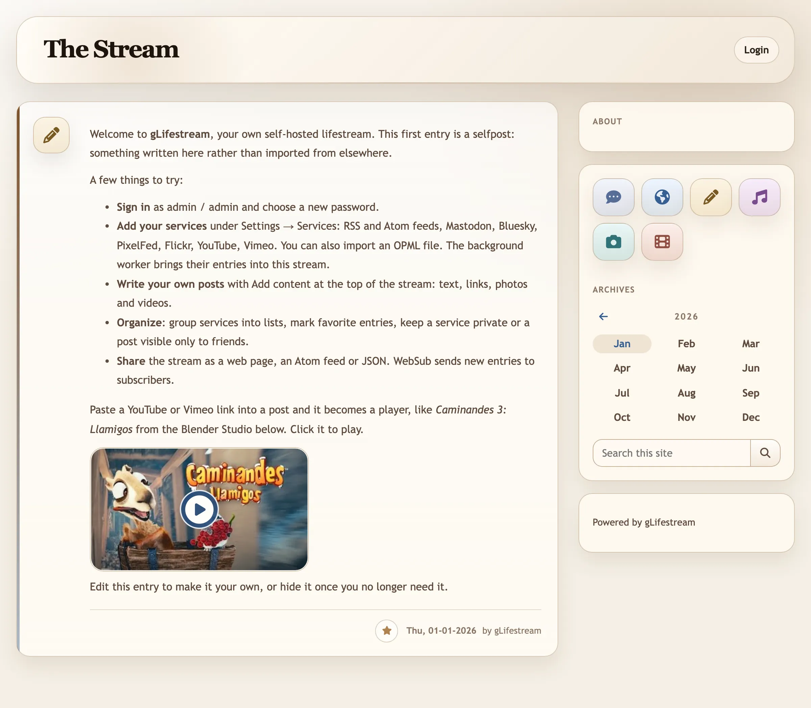

gLifestream
===========

gLifestream is a free lifestream platform and social activity reader.
It is licensed under GPLv3.

<picture>
  <source media="(prefers-color-scheme: dark)" srcset="docs/screenshots/stream-dark.webp">
  
</picture>

Introduction
------------

gLifestream joins several external and/or internal streams into a
single one.  External streams may be represented by RSS/Atom channels
or popular services such as Mastodon.  The user decides which of them
are publicly visible and which are not.  Public streams are visible
for anybody.  The rest of the streams are visible only for logged-in
users.

gLifestream is a Django application.  It needs a web server that can
run Django, a database supported by Django (SQLite is enough for a
single owner), and a background worker process that fetches the
configured streams.  The worker stores what it fetches in the database
and keeps local copies of the images, so your messages, links and
photos remain intact even if the service they came from ceases to
exist.

You can see gLifestream running at <https://wojciechpolak.org/stream/>,
the author's own stream. It shows the public view; the private streams,
favorites and settings need a sign-in.

Getting started
---------------

See [INSTALL](INSTALL.md) for the full setup and deployment guide.

- For local development, `./scripts/bootstrap` sets up a fresh checkout in one
  command; `INSTALL.md` covers the steps it runs, the initial admin user, and
  the background worker.
- For production, `INSTALL.md` covers both the shipped Docker/Compose path and
  non-Docker deployments, including the key environment variables and hardening
  expectations.
- To work on gLifestream itself, see [CONTRIBUTING](CONTRIBUTING.md) for the
  checks, test conventions and what a pull request needs.

Supported services (out of the box)
-----------------------------------

gLifestream supports the following services by default:

- Any RSS/Atom feed
- Mastodon
- Bluesky
- Flickr
- PixelFed
- Vimeo
- YouTube

Twitter entries imported in the past are still shown, but new ones can
no longer be fetched: the Twitter API v1.1 that gLifestream used is gone.

To support another service, write a provider module; see
[Adding things](docs/ARCHITECTURE.md#adding-things) in the architecture
document.

Features
--------

- Free, self-hosted web application, with a Docker image and Compose setup
- Automatic imports of external streams, with per-service status and
  retries when a fetch fails
- Public and Private views
- Friends-only posts via [Magic Link SSO](https://github.com/magic-link-sso/magic-sso)
- User views: Favorite entries, Archives, custom stream lists
- Automatic expansion of shortened URLs
- Embedded multimedia views
- Out-of-the-box output formats: HTML5, Atom, JSON
- Search functionality
- WebSub support (publisher and subscriber)
- OAuth 1.0 and 2.0 support
- Write posts by web or e-mail (including media attachments)
- Share entries to Mastodon, Bluesky and X, or through Web Share
- Installable as a Progressive Web App
- Keyboard shortcuts for navigation
- Customizable themes, including a dark mode
- Localization
